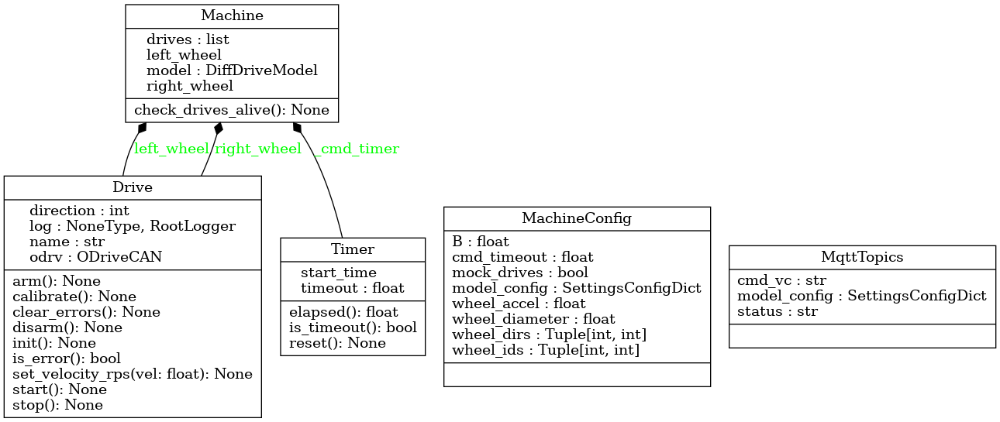

# AlphaCeresMotion

**-------------------DEPRECATED----------------------**

Code in this repo moved to https://gitlab.com/roxautomation/machines/gamma

**---------------------------------------------------**

Motion container for Alpha Ceres machine.

## Class diagram

## Development

1. develop and test in devcontainer (VSCode)
2. run ci on **host** with `invoke ci`

## Tooling

* Automation: `invoke` - run `invoke -l` to list available commands. (uses `tasks.py`)
* Verisoning : `setuptools_scm`
* Linting : `pylint`
* Formatting: `black`
* Typechecking: `mypy`

## What goes where
* `src/alpha_motion` app code. `pip install .` .
* `tasks.py` automation tasks.

## Running Integration Tests

1. on **host** system, run `docker compose up` in the `integration` folder. This will start an mqtt broker.
2. open this repo in devcontainer
3. Either have the Odrives connected, or simulate them with `motion run mock-drives`
4. Start the machine with `motion run machine`
5. Send mqqt input commands with `integration/motion_tester.py` or joystick.

* To monitor the published MQTT messages, use the command `mosquitto_sub -t /# -v`. This will display all MQTT messages and their topics.
* To monttor can bus interface, use
    - `candump <interface>` to show raw data
    - `odrive_can inspect <interface> to show decoded odrive messages

## Showing debug output

* set env variable `export LOGLEVEL=debug`

## Building docker image

Build docker image on target system with

`invoke build-image`
